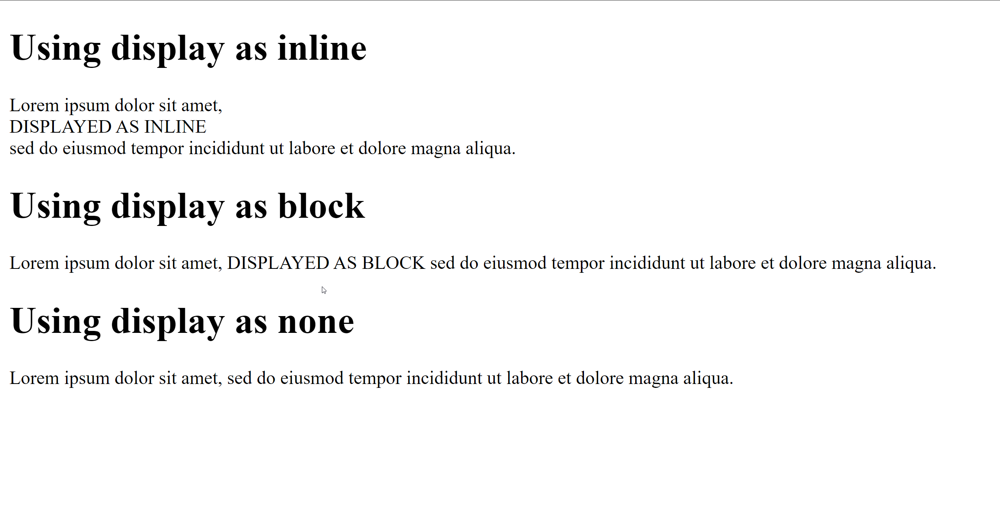

The following css:

```css
#topspan {
  display: block;
}
#middlespan {
  display: inline;
}
#bottomspan {
  display: none;
}
```

Will produce this result, when applied to the full caps text:



As you can see, the text is not shown in the third paragraph, as it is diplayed as **none**.
