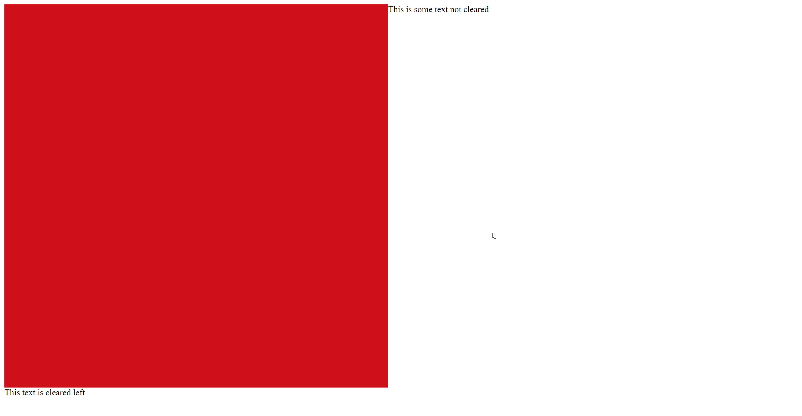

## Float

Float sticks the element to that side of the page.

### Example

```css
float: right;
```

Would produce this when applied to the red image:


## Clear

Clear specifies which side of the element cannot be touching another element.

### Example

```css
clear: left;
```

