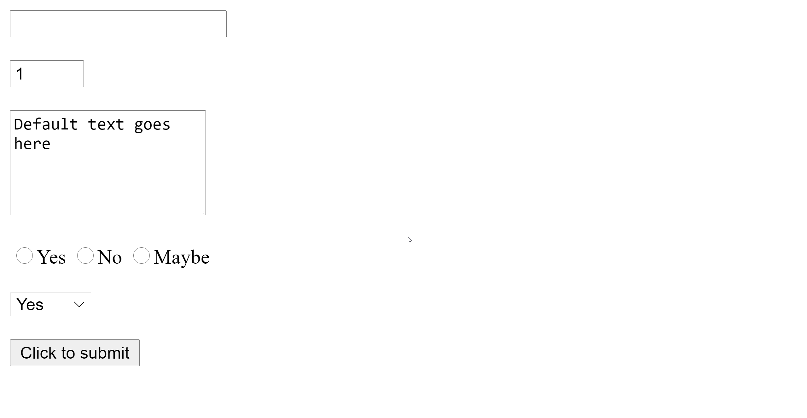

First, surround the form with form tags:

```html
<form>
  <!-- Form inputs go here -->
</form>
```

Text input:

```html
<input type="text" maxlength="15" required>
<!-- Makes the maximum length 15 and makes the field required -->
```

Number input:

```html
<input type="number" value="1" min="1" max="3">
<!-- Sets the default value to 1, and the range to 1-3 -->
```

Large bodies of text:

```html
<textarea rows="5" cols="20">Default text goes here</textarea>
<!-- Rows and cols sets the size of the box -->
```

Radio buttons:

```html
<input type="radio" name="option" value="yes">Yes
<input type="radio" name="option" value="no">No
<input type="radio" name="option" value="maybe">Maybe
```

Drop-down menus:

```html
<select>
  <option value="yes">Yes</option>
  <option value="no">No</option>
  <option value="maybe">Maybe</option>
</select>
```

Submit button:

```html
<input type="submit" value="Click to submit">
```

Putting this all together looks like this:


